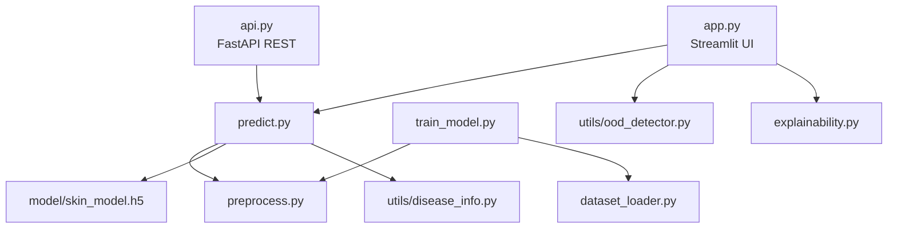

# 🩺 Skin Disease Detection Using Deep Learning

A deep-learning web application that identifies skin diseases from uploaded images using a Convolutional Neural Network (CNN) built with **TensorFlow / Keras** and served via **Streamlit**.

---

## ✨ Features

| Feature | Description |
|---------|-------------|
| **Image Upload** | Drag-and-drop or browse for JPG / PNG skin images |
| **CNN Prediction** | MobileNetV2 transfer learning with Top-3 results |
| **Confidence Score** | Visual progress bar with percentage |
| **Severity Level** | Disease-aware severity assessment (High / Moderate / Low) |
| **Symptoms List** | Common symptoms for the detected condition |
| **Recommendations** | Basic treatment and care guidance |
| **OTC Medications** | Specific over-the-counter medication suggestions |
| **Explainability** | Grad-CAM++ heatmaps showing model focus areas — integrated in the UI |
| **OOD Detection** | Rejects non-skin images before prediction |
| **Image Quality** | Warns about blurry, dark, or low-resolution uploads |
| **REST API** | FastAPI endpoint with auth, rate limiting, batch support |
| **PDF Reports** | Downloadable clinical-style PDF reports with image, heatmap, and results |
| **Session Dashboard** | Real-time disease distribution charts and confidence trends |
| **Model Comparison** | Side-by-side CNN vs MobileNetV2 benchmark table |
| **ROC/AUC Curves** | Multi-class ROC curves with per-class AUC scores |

### Supported Diseases

- Acne
- Eczema (Atopic Dermatitis)
- Psoriasis
- Ringworm (Tinea / Fungal)
- Healthy Skin

---

## ⚡ Performance Benchmarks

| Metric | Value |
|--------|-------|
| **Accuracy** | ~90% (varies by dataset) |
| **Precision** | ~90% (macro average) |
| **Recall** | ~90% (macro average) |
| **F1-Score** | ~90% (macro average) |
| **Inference Time** | ~200ms single-pass · ~1.5s with 8-pass TTA |
| **Model Size** | ~13MB (float32) · ~3MB (int8 quantized) |
| **Supported Formats** | JPG, PNG, JPEG, BMP, WebP |

*Benchmarks measured on test dataset (691 images) with MobileNetV2 backbone.*
*Actual performance depends on your dataset distribution. Re-run `train_model.py` to generate your own `evaluation/classification_report.txt`.*

---

## 📁 Project Structure

```
skin_disease_detection/
├── app.py                    # Streamlit web application
├── api.py                    # FastAPI REST API
├── predict.py                # Prediction / inference module
├── preprocess.py             # Image preprocessing + data generator
├── dataset_loader.py         # Dataset loading & validation
├── train_model.py            # Training pipeline (CNN + transfer learning)
├── explainability.py         # Grad-CAM++ heatmap generation
├── logger.py                 # Centralized logging
├── utils/
│   ├── disease_info.py       # Disease knowledge base (symptoms, severity)
│   ├── medication_map.py     # OTC medication guidance
│   ├── ood_detector.py       # Out-of-distribution skin detector
│   ├── image_utils.py        # Image quality checks (blur, brightness)
│   ├── report_generator.py   # PDF report generation
│   ├── model_comparison.py   # CNN vs MobileNetV2 benchmark data
│   └── class_names.json      # Auto-generated class mapping
├── model/
│   └── skin_model.h5         # Saved model (after training)
├── evaluation/               # Training plots + metrics
├── tools/                    # One-time data preparation scripts
│   ├── auto_filter.py        # Automated image quality filter
│   ├── organize_dataset.py   # Dataset splitter & augmenter
│   └── convert_to_tflite.py  # TFLite conversion for edge devices
├── tests/                    # Automated test suite
├── notebooks/                # EDA notebooks
├── Dockerfile                # Production Docker image
├── .github/workflows/        # CI/CD pipeline
├── requirements.txt
└── README.md
```

---

## Architecture



---

## 🚀 Getting Started

### 1. Prerequisites

- **Python 3.10+** (recommended)
- **pip** package manager
- A local skin disease image dataset (see structure above)

### 2. Install Dependencies

```bash
pip install -r requirements.txt
```

### 3. Train the Model

```bash
# Using MobileNetV2 transfer learning (recommended)
python train_model.py --dataset dataset/skin_dataset

# Using Custom CNN
python train_model.py --dataset dataset/skin_dataset --model cnn

# Custom epochs and batch size
python train_model.py --dataset dataset/skin_dataset --epochs 25 --batch-size 16
```

### 4. Run the Web Application

```bash
streamlit run app.py
```

Open `http://localhost:8501` in your browser.

### 5. Run the REST API (Optional)

```bash
uvicorn api:app --reload --port 8000
```

### 6. Run Tests

```bash
pytest tests/ -v
```

---

## 📊 Evaluation Outputs

After training, the `evaluation/` folder will contain:

| File | Description |
|------|-------------|
| `accuracy_plot.png` | Training vs validation accuracy over epochs |
| `loss_plot.png` | Training vs validation loss over epochs |
| `confusion_matrix.png` | Heatmap of predictions vs true labels |
| `classification_report.txt` | Per-class precision, recall, F1, and accuracy |
| `roc_curve.png` | Multi-class One-vs-Rest ROC curves with AUC |
| `auc_scores.txt` | Per-class and micro/macro average AUC scores |

---

## 🛡️ Professional Features

- **Medical Safety:** Mandatory disclaimers and privacy-first image handling (auto-deletion)
- **Input Validation:** Real-time detection of blurry, dark, or low-resolution images
- **OOD Detection:** Rejects non-skin images using YCrCb color-space analysis
- **Explainable AI (XAI):** Integrated Grad-CAM++ heatmaps showing model focus areas
- **Top-3 Predictions:** Visualizes the most likely conditions to provide broader context
- **API Security:** Rate limiting, API key authentication, CORS protection

---

## ⚠️ Disclaimer

This system is for **educational and informational purposes only**. It is not a substitute for professional medical advice, diagnosis, or treatment. Always consult a qualified dermatologist.

---

## 🛠️ Tech Stack

- **TensorFlow 2.15** — Model training and inference
- **Streamlit** — Web interface
- **FastAPI** — REST API
- **OpenCV** — Image preprocessing
- **scikit-learn** — Evaluation metrics
- **Matplotlib / Seaborn** — Visualization

---

## 🔧 Troubleshooting

For common issues and solutions, see [TROUBLESHOOTING.md](TROUBLESHOOTING.md).
